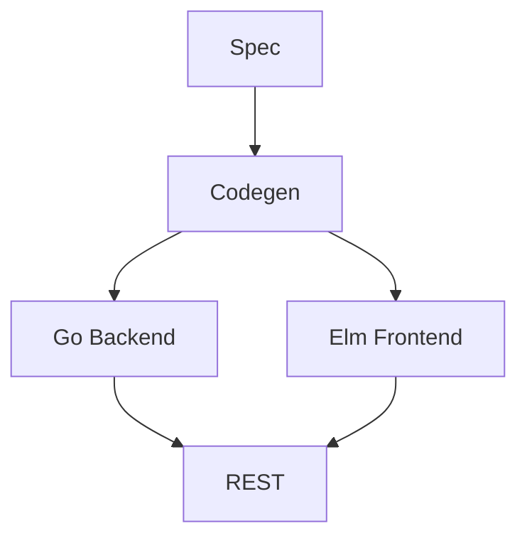

# BerlinClock – Spec-Driven Development (SDD)

Diese README ist der aktuelle vollständige Stand.

## Struktur
- backend/ – generierter und manueller Go-Code
- frontend/ – Elm-Frontend
- spec/ – OpenAPI & Domain-Spezifikationen
- ci/ – Codex & Codegen-Pipelines
- .github/workflows – CI/CD

## SDD-Prozess
1. Anforderungen → Domain-Spezifikation
2. Specs → API & Domain
3. Generatoren erzeugen Code automatisch
4. PRs werden erstellt, wenn Abweichungen entstehen

## Codegeneration
### Backend (OpenAPI → Go)
Script:
- ci/codegen/generate-backend.sh  
Workflow:
- .github/workflows/codegeneration.yml

### Frontend (OpenAPI → Elm)
Script:
- ci/codegen/generate-frontend.sh  
Workflow:
- .github/workflows/build.yml

### Business Logic (Domain → Go)
Script:
- ci/codex/generate_business_logic.py  
Workflow:
- .github/workflows/codex-generate-business.yml  

Generated Code:
- backend/src/business_logic.generated.go

## Lokale Ausführung

### Backend
```
cd backend/gen/api
go build ./...
```

### Frontend
```
cd frontend
elm make src/Main.elm --output=main.js
```

## Wichtige Hinweise
- .venv wird genutzt für Codex-Generator
- openapi-generator-cli wird über npx genutzt
- Alle generierten Files werden automatisch in PRs geschrieben

## SDD-Stabilität
Die Pipelines prüfen:
- ob Codegenerator identisch wiederherstellbar ist
- ob Specs unverändert bleiben
- ob generierter Code deterministisch ist




## 🚀 Development Mode
Startet Backend & Frontend:
```bash
./dev.sh
```

## ▶️ Backend starten
```bash
go run ./backend/cmd/api
```
